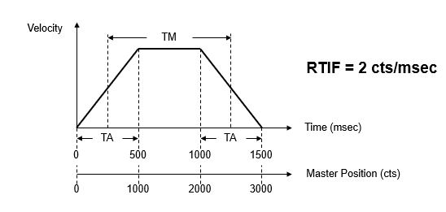
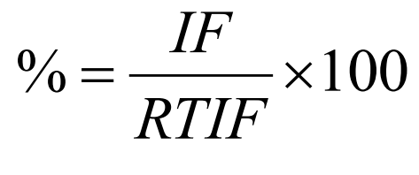
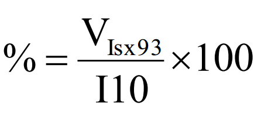
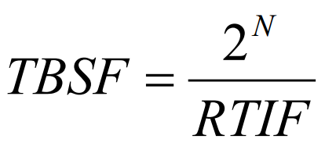
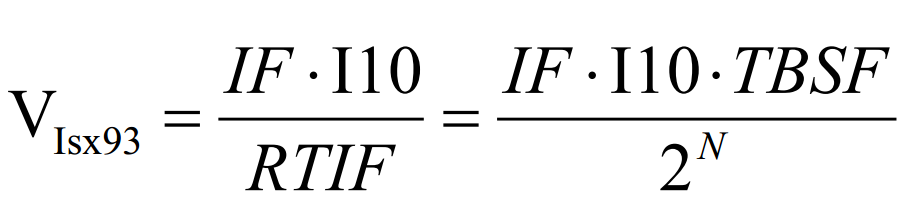

# Delta Tau Motion Controller 

## Mr Nitin Nandeshwar
### 14 November 2012

## Introduction:

Consider 3 motors and there connection are as follows:
         #4 -> main motor
         #1-> X-axis
         #2->Y-Axis

Configuration of all motors are  
- main motor  2krpm ,1kw
- slave motor 3krpm,750w

Main motor rotate for 10,000 counts/revolution.
So out of 10,000 pulse
1) In 1st 2,000 pulses, #1 and #2 should complete its task which is assigned to them the task is variable.
2) In 2nd 8,000 pulses,#1 and #2 should be rest.

### PMAC stands for Programmable Multi-Axis Controller

PMAC is one of the world’s most flexible and powerful motion controllers (& PLCs), it is used in a wide variety of applications ranging from the simplest to those requiring extremely high performance. Requirements such as accuracy, precision, speed, and power, whether combined or independently.

## Turbo PMAC Controller : 

Turbo PMAC handles all of the tasks required for machine control, constantly switching back and forth between the different tasks thousands of times per second.

## CONTROLLER BASIC SPECIFICATIONS:
* Turbo PMAC DSP processor
* USB, Ethernet, and RS-232 communications
* Full 4-axis servo interface, each including:
    * Fully digital PWM generation
    * Quadrature encoders with Hall sensors
    * Home, limit, and “user” trigger input flags
    * “Compare” trigger output flag
* General-purpose sinking/sourcing isolated digital I/O:
    * 16 inputs at 12-24V
    * 15 outputs at 12-24V, 500mA each
    * “Multiplexer” port allows I/O expandability
* 2 channels auxiliary “handwheel” encoders
* 2 channels auxiliary pulse outputs (pulse and direction or PWM)
* CPU watchdog safety interface
* Built-in emergency stop safety circuitry
* CNC G-code compatibility

## AMPLIFIER BASIC SPECIFICATIONS:
* Supports DC brush, brushless, and stepper motors (1, 2, and 3-phase)
* DC bus (input) voltage: 12 – 60 VDC
* Output current per axis: 5A cont., 15A peak (1 sec)
* Programmable PWM frequency: 2 – 40 kHz
* Protections: over/under voltage, over temperature, over current, short circuit
* Integrated 24VDC-input power supply for logic
circuits

####  Turbo PMAC consists of:
* A Digital Signal Processor (Motorola’s DSP56300 family)
* Machine interface ICs, ASIC (i.e. Servo, MACRO)
* Memory (SRAM & Flash) 
* Digital electronic circuitry
* Power electronic circuitry (i.e. amplifier products)

#### Turbo PMAC executes (in an elaborately prioritized fashion):
* PLC Programs
*  Motion Programs (independently of PLCs)
* Motor Servo Update
* Motor Commutation
* Housekeeping (safety checks)
* Host Communication 

#### Turbo PMAC handles (in a synchronized fashion):
* 32 motors/axes
* 16 coordinate systems
* Forward and Inverse kinematic algorithms
* Multi-block Lookahead algorithms
* 32,768 user variables
* Simultaneous multiple host communication

## Time Base Operation:
PMAC motion trajectory is usually defined as a position vs. time function

The operating principle of Time Base Control is to replace time with master position to create a position vs. position trajectory function

The relationship between real time and nominal master position is called the Real-Time Input Frequency (RTIF). 

RTIF (cts/msec):	 nominal speed of master position (i.e. when Feedrate = 100%)

After the RTIF is determined , the real speed of the master position will become an input comparing to RTIF to determine Feedrate. This is called the Input Frequency (IF)

IF (cts/msec):	Real speed of master encoder

% Feedrate of a time-base-controlled coordinate system is determined by the IF/RTIF ratio, which means that when the master is speeding up, the motion of that coordinate system will also speed up accordingly

### PMAC %Feedrate calculation and Isx93

On power-on ,or $$$ reset, or command “%100”, the value of I10 will be copied once to the addresses specified by Isx93, Coordinate System x Time Base Control Address.
Let the value in Isx93 address be VIsx93, and then the Feedrate value is determined by the following equation:

If Isx93 is pointing to an address which contains the value of the related calculation result from IF and RTIF, then the Feedrate will change according to that result

### TBSF: Time Base Scale Factor

The time base setup in PMAC used TBSF instead of RTIF
The relationship is as follows:

N=17 for normal time base
N=14 for triggered time base

### TBSF needs to be and INTEGER

If a RTIF is chosen and the corresponding TBSF is not an integer, then move durations may not be accurate since the register of TBSF will ignore decimal values.
Usually if RTIF is chosen as 2^𝑛/𝑖𝑛𝑡𝑒𝑔𝑒𝑟(𝑛≤𝑁), then TBSF will be an integer.

If for any reason a RTIF must be selected to have non-integer TBSF, then a MTSF, Move Time Scale Factor, must be implemented for move time adjustment.

[Time Base Motioncontroller code]()
